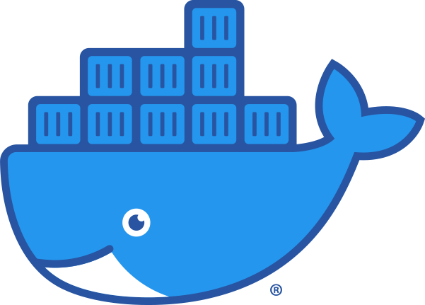
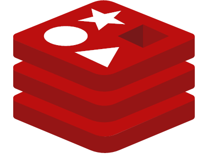
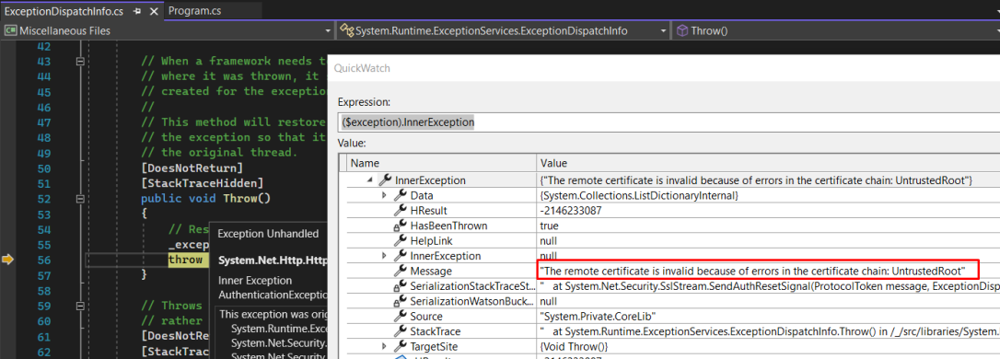
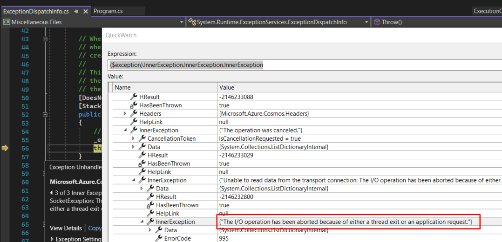

# About assets-cosmosdb-rediscache-docker-compose

ERNI Academy assets to run Azure Cosmos DB emulator with RedisCache and Redis Command.

<!-- ALL-CONTRIBUTORS-BADGE:START - Do not remove or modify this section -->
<!-- ALL-CONTRIBUTORS-BADGE:END -->

## Features

-  [Docker](https://www.docker.com/)
-  [Docker-Compose](https://docs.docker.com/compose/)
-  [CosmosDB emulator](https://docs.microsoft.com/en-us/azure/cosmos-db/linux-emulator?tabs=ssl-netstd21)
-  [Redis Cache](https://redis.io/)
-  [Redis Commander](http://joeferner.github.io/redis-commander/)

## Getting Started

This is an asset that helps developers to run the Azure infrastructure locally.

Before run the infrastructure you need to get your local IP

### **Windows developers**

Run the following command:

```sh
ipconfig
```

### **Linux developers**

Run the following command:

```sh
ipaddr="`ifconfig | grep "inet " | grep -Fv 127.0.0.1 | awk '{print $2}' | head -n 1`"
```


Copy your local Ip and replace the **\<YOUR-LOCAL-IP\>** at the **docker-compose.yml** with it.

Then run the following command to start the infrastructure:

```sh
docker-compose up
```

Now you can access

- Azure CosmosDB Emulator UI at: [https://localhost:8081/_explorer/index.html](https://localhost:8081/_explorer/index.html).
- Redis Cache UI at [http://localhost:8082/](http://localhost:8082/)

You can see that the cosmos emulator UI website is not secured, run the following command to import and install the required certificate:

### **Windows developers**

```sh
.\ImportCosmosDbCertificate.ps1
```
### **Linux developers**

1. Get the local IP

```sh
ipaddr="`ifconfig | grep "inet " | grep -Fv 127.0.0.1 | awk '{print $2}' | head -n 1`"
```

2. Download the certificate

```sh
curl -k https://$ipaddr:8081/_explorer/emulator.pem > ~/emulatorcert.crt
```

3. Copy the certificate to the right folder

```sh
cp ~/emulatorcert.crt /usr/local/share/ca-certificates/
```

4. Update the TLS/SSL certificates

```sh
update-ca-certificates
```

For Java developers, the certificate must be imported to the [Java trusted store](https://docs.microsoft.com/en-us/azure/cosmos-db/local-emulator-export-ssl-certificates)

```sh
keytool -keystore ~/cacerts -importcert -alias  emulator_cert -file ~/emulatorcert.crt
java -ea -Djavax.net.ssl.trustStore=~/cacerts -Djavax.net.ssl.trustStorePassword="changeit" $APPLICATION_ARGUMENTS
```

**For c# developers** you need to add the following snipped to the start:

```csharp
var context = 
    new ServiceCollection()
        .AddCosmos<CosmosDbContext>(
            connectionString: "AccountEndpoint=https://localhost:8081/;AccountKey=C2y6yDjf5/R+ob0N8A7Cgv30VRDJIWEHLM+4QDU5DE2nQ9nDuVTqobD4b8mGGyPMbIZnqyMsEcaGQy67XIw/Jw==",
            databaseName: "CosmosDb")
        .BuildServiceProvider()
        .GetRequiredService<CosmosDbContext>();

```

Possible Issues
If everything was done correctly you should not have any issues. But when you run your application you may see following issues:

The remote certificate is invalid because of errors in the certificate chain: UntrustedRoot



To resolve this issue, make sure you properly has installed the certificate into the Trusted Root store.

You can also disable SSL validation:
```csharp
CosmosClientOptions cosmosClientOptions = new CosmosClientOptions()
{
    HttpClientFactory = () =>
    {
        HttpMessageHandler httpMessageHandler = new HttpClientHandler()
        {
            ServerCertificateCustomValidationCallback = HttpClientHandler.DangerousAcceptAnyServerCertificateValidator
        };

        return new HttpClient(httpMessageHandler);
    },
    ConnectionMode = ConnectionMode.Gateway
};


CosmosClient client = new CosmosClient(endpoint, authKey, cosmosClientOptions);
```

The I/O operation has been aborted because of either a thread exit or an application request



If you see this error, make sure that you has set AZURE_COSMOS_EMULATOR_IP_ADDRESS_OVERRIDE variable with correct IP address of your local machine

**Node.js app**

If you attempt to connect to the emulator via an address other than localhost, such as the containers IP address, Node.js will raise an error about the certificate being self-signed, even if the certificate has been installed.

TLS verification can be disabled by setting the environment variable NODE_TLS_REJECT_UNAUTHORIZED to 0:

```sh
NODE_TLS_REJECT_UNAUTHORIZED=0
```

## Possible issues:
**Redis Docker**

```sh
# WARNING overcommit_memory is set to 0! Background save may fail under low memory condition. To fix this issue add 'vm.overcommit_memory = 1' to /etc/sysctl.conf and then reboot or run the command 'sysctl vm.overcommit_memory=1' for this to take effect.
```

Run the following commands:

```sh
wsl -d docker-desktop sysctl -w vm.overcommit_memory=1
```

## Contributing

Please see our [Contribution Guide](CONTRIBUTING.md) to learn how to contribute.

## License

[MIT](LICENSE) © 2022 [ERNI - Swiss Software Engineering](https://www.betterask.erni)

## Code of conduct

Please see our [Code of Conduct](CODE_OF_CONDUCT.md)

## Stats


**Contact:** 
Erni_Services  - [@ERNI](https://twitter.com/ERNI) - esp-services@betterask.erni

## Contributors ✨

Thanks goes to these wonderful people ([emoji key](https://allcontributors.org/docs/en/emoji-key)):

<!-- ALL-CONTRIBUTORS-LIST:START - Do not remove or modify this section -->
<!-- ALL-CONTRIBUTORS-LIST:END -->
This project follows the [all-contributors](https://github.com/all-contributors/all-contributors) specification. Contributions of any kind welcome!
